# Leadscaptain demo: application flows and file reference

This is the "where is it and how does it work" reference for the whole repository:
the Laravel 12 demo app, the `packages/leadscaptain` package, the Docker setup and
the tests. Use it to follow a flow end to end, or to look up any file and see what
it does, who uses it and which flow it belongs to.

For the design view (layers, data model, open decisions) see
[architecture.md](architecture.md). This file is the operational view.

**State described:** commit `af1101b` (steps 1–5 done; step 7 leads endpoint done;
step 6 on hold).

**Status marks used below**

| Mark | Meaning |
|---|---|
| 🟢 Live | Runs in the demo app today |
| 🔵 Built, not wired | Code and tests exist, but nothing in the app calls it yet (needs step 6/7 wiring) |
| ⚪ Planned | Not written yet |

---

## Contents

1. [The big picture](#1-the-big-picture)
2. [What runs today](#2-what-runs-today)
3. Flows
   - [F1 Starting the stack](#f1-starting-the-stack-)
   - [F2 First-time setup](#f2-first-time-setup-)
   - [F3 How a web request reaches Laravel](#f3-how-a-web-request-reaches-laravel-)
   - [F4 Package boot (service provider)](#f4-package-boot-service-provider-)
   - [F5 Listing stored leads: GET /api/leadscaptain/leads](#f5-listing-stored-leads-get-apileadscaptainleads-)
   - [F6 Importing one page of leads](#f6-importing-one-page-of-leads-)
   - [F7 Orchestrated sync (queue path)](#f7-orchestrated-sync-queue-path-)
   - [F8 In-process sync (--now path)](#f8-in-process-sync---now-path-)
   - [F9 Calling the Leadscaptain API](#f9-calling-the-leadscaptain-api-)
   - [F10 Rate limiting](#f10-rate-limiting-)
   - [F11 Storing leads](#f11-storing-leads-)
   - [F12 Configuration](#f12-configuration-)
   - [F13 Logging](#f13-logging-)
   - [F14 Mock Leadscaptain API](#f14-mock-leadscaptain-api-)
   - [F15 Tests and quality checks](#f15-tests-and-quality-checks-)
   - [F16 Docker images](#f16-docker-images-)
   - [F17 Planned flows](#f17-planned-flows-)
4. [File reference](#4-file-reference)
5. [Where do I look when...](#5-where-do-i-look-when)
6. [Command cheat sheet](#6-command-cheat-sheet)

---

## 1. The big picture

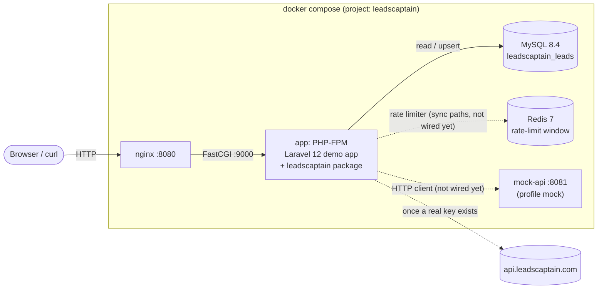

Inside the package the code follows Onion Architecture. Dependencies only point inwards:

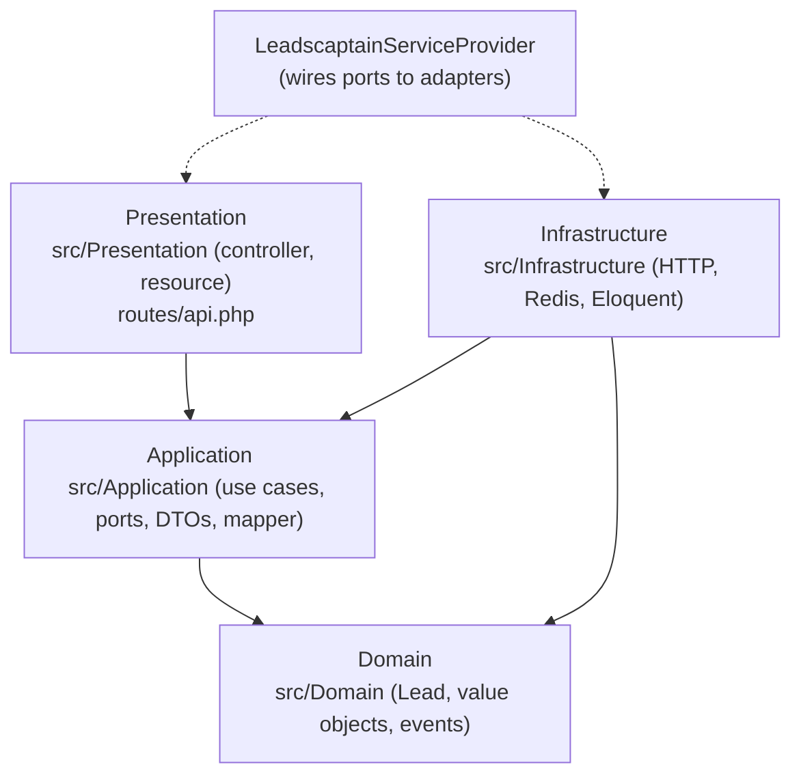

| Layer | Folder | May use | Must not use |
|---|---|---|---|
| Domain | `src/Domain` | plain PHP | Laravel, Guzzle, any other layer |
| Application | `src/Application` | Domain | Laravel (incl. `config()`, `app()`), Infrastructure, Presentation |
| Infrastructure | `src/Infrastructure` | Laravel, Domain, Application | Presentation |
| Presentation | `src/Presentation`, `routes/` | Laravel, Application, Domain | Infrastructure |

`tests/Unit/Architecture/LayerBoundariesTest.php` fails the build if these rules are broken.

---

## 2. What runs today

| Capability | Status | Entry point |
|---|---|---|
| Docker stack (nginx, app, MySQL) | 🟢 | `docker compose up -d --wait` |
| Redis | 🟢 when started | `docker compose --profile queue up -d redis` |
| Mock API | 🟢 when started | `make mock-up` |
| Migrations incl. `leadscaptain_leads` | 🟢 | `php artisan migrate` |
| List stored leads (JSON) | 🟢 | `GET /api/leadscaptain/leads` |
| `leadscaptain` JSON log channel | 🟢 | `Log::channel('leadscaptain')` |
| HTTP client, rate limiter, retries | 🔵 | tested; not bound in the provider yet |
| Import page / orchestrated sync / `--now` sync | 🔵 | use cases tested; no command or job yet |
| Jobs, batch, Horizon, events, failure notification | ⚪ | step 6 |
| `leadscaptain:sync` command, `POST /sync`, `GET /sync/{id}` | ⚪ | step 7 (after step 6) |
| CI pipeline | ⚪ | step 8 |

The 1,234 leads now in MySQL were imported during step 5 checks by running the
real HTTP client, `SyncLeadsImmediately` and `EloquentLeadRepository` from a
throwaway script against the mock API. That script is not part of the repo; the
`leadscaptain:sync --now` command will replace it.

---

## F1 Starting the stack 🟢

**Trigger:** `make up` or `docker compose up -d --wait`

1. `docker-compose.yml` starts the default services: `app`, `nginx`, `db`.
   Services behind profiles (`queue`: redis, horizon; `mock`: mock-api;
   `test`: package-tests) only start when their profile is given.
2. `app` is built from `Dockerfile` target `dev` and bind-mounts the repo at
   `/var/www/html`, so code changes on Windows are visible immediately.
3. `db` must pass its healthcheck (`mysqladmin ping`) before `app` starts.
4. `nginx` serves `public/` read-only and forwards `.php` requests to `app:9000`.

| File | Role in this flow |
|---|---|
| `docker-compose.yml` | Defines services, ports (8080 web, 3307 MySQL, 6380 Redis, 8081 mock), volumes, profiles |
| `Dockerfile` | Builds the `app` image (`base` → `dev`) |
| `docker/php/php.ini` | PHP settings (memory, errors to stderr, opcache) |
| `docker/nginx/default.conf` | Web server config |
| `.env` | Runtime settings read by Laravel (not in git) |
| `Makefile` | Shortcuts (`make up`, `make down`, ...) |

---

## F2 First-time setup 🟢

**Trigger:** `make setup` = `build` → `bootstrap` → `up` → `migrate`

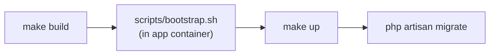

What `scripts/bootstrap.sh` does (safe to re-run):

1. If `artisan` is missing, creates a Laravel 12 skeleton and moves it into the repo
   without overwriting existing files.
2. Copies `.env.example` to `.env` if needed and points it at the Docker services
   (`DB_HOST=db`, ...). Adds `LEADSCAPTAIN_*` keys only if missing.
3. Registers `packages/leadscaptain` as a Composer **path repository** (symlinked)
   and requires `leadscaptain/laravel-leadscaptain:@dev`.
4. Runs `php artisan key:generate` **only if** `.env` has no `APP_KEY`.
5. Publishes the package config to `config/leadscaptain.php`.

| File | Role |
|---|---|
| `scripts/bootstrap.sh` | The setup script above (must keep LF line endings) |
| `.env.example` | Template for `.env` (APP_ENV=local, Docker hosts, LEADSCAPTAIN_* keys) |
| `composer.json` | Host app dependencies, including the path repository to the package |
| `composer.lock` | Locked versions; the package entry points at `./packages/leadscaptain` |
| `config/leadscaptain.php` | Published copy of the package config (see F12) |

After setup, `vendor/leadscaptain/laravel-leadscaptain` is a symlink to
`packages/leadscaptain`, so package edits take effect without reinstalling.
Run Composer only inside the container: a symlink created on Windows does not work
in Linux.

---

## F3 How a web request reaches Laravel 🟢

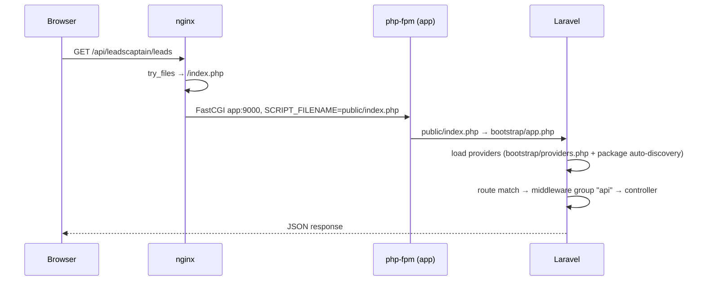

| File | Role |
|---|---|
| `docker/nginx/default.conf` | `try_files $uri $uri/ /index.php?$query_string`, FastCGI to `app:9000`, hides dotfiles |
| `public/index.php` | Laravel front controller |
| `bootstrap/app.php` | Creates the application, registers `routes/web.php` and `routes/console.php` |
| `bootstrap/providers.php` | Host app providers (`AppServiceProvider`) |
| `packages/leadscaptain/composer.json` → `extra.laravel.providers` | Package auto-discovery: registers `LeadscaptainServiceProvider` |
| `routes/web.php` | Host route `/` → `welcome` view |
| `packages/leadscaptain/routes/api.php` | Package route `leads` (prefixed, see F4/F5) |

---

## F4 Package boot (service provider) 🟢

**File:** `packages/leadscaptain/src/LeadscaptainServiceProvider.php`
Runs on every request and every artisan command.

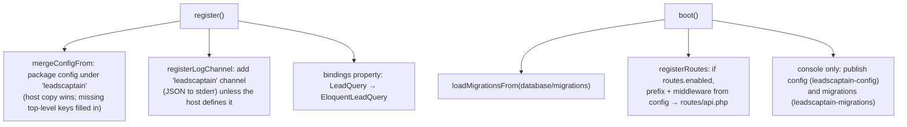

| Binding (interface → implementation) | Status |
|---|---|
| `Application\Contract\LeadQuery` → `Infrastructure\Persistence\EloquentLeadQuery` | 🟢 |
| `Domain\Lead\LeadRepository` → `EloquentLeadRepository` | ⚪ step 6 |
| `Application\Contract\LeadsApiClient` → `LeadscaptainHttpClient` | ⚪ step 6 |
| `Infrastructure\RateLimit\RequestRateLimiter` → `RedisRateLimiter` | ⚪ step 6 |
| `Application\Contract\DomainEventPublisher` → Laravel publisher | ⚪ step 6 |
| `Application\Contract\PageImportScheduler` → batch scheduler | ⚪ step 6 |
| `Application\Config\SyncSettings` built from config | ⚪ step 6 |

---

## F5 Listing stored leads: GET /api/leadscaptain/leads 🟢

**Try it:** http://localhost:8080/api/leadscaptain/leads?page=1&per_page=20

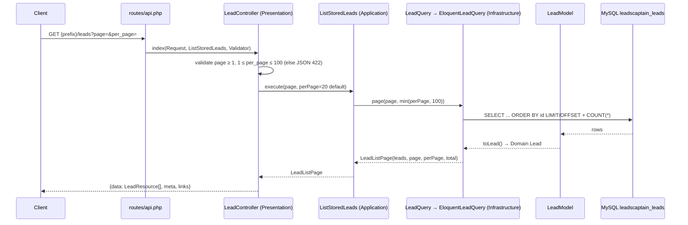

**Response shape**

```json
{
  "data": [
    {
      "profile_key": "1",
      "full_name": "Maria Murphy",
      "email": "maria.murphy.1@example.com",
      "position_title": "Head of Sales",
      "company_name": "ABC Technologies",
      "industry": "Manufacturing",
      "location": null,
      "country_code": "GB",
      "attributes": { "id": 1, "email_status": "verified", "...": "full source record" }
    }
  ],
  "meta": { "page": 1, "per_page": 20, "total": 1234, "last_page": 62 },
  "links": { "self": "...?page=1", "next": "...?page=2", "prev": null }
}
```

| Step | File | What it does |
|---|---|---|
| Route | `packages/leadscaptain/routes/api.php` | `GET leads` named `leadscaptain.leads.index` |
| Prefix / middleware / on-off | `config/leadscaptain.php` → `routes` | Default `api/leadscaptain`, `['api']`, enabled |
| Controller | `src/Presentation/Http/Controllers/LeadController.php` | Validates query, calls the use case, builds `meta` and `links`; errors are always JSON 422 |
| Resource | `src/Presentation/Http/Resources/LeadResource.php` | One lead → JSON fields |
| Use case | `src/Application/UseCase/ListStoredLeads.php` | Rejects page/size < 1, caps size at `MAX_PER_PAGE = 100` |
| Port | `src/Application/Contract/LeadQuery.php` | `page(int $page, int $perPage): LeadListPage` |
| DTO | `src/Application/Dto/LeadListPage.php` | Leads + page numbers; `lastPage()`, `hasMorePages()` |
| Adapter | `src/Infrastructure/Persistence/EloquentLeadQuery.php` | Ordered offset/limit query + count |
| Model | `src/Infrastructure/Persistence/LeadModel.php` | Row → Domain `Lead` via `toLead()` |

**Security:** no authentication by default. Add middleware such as `auth:sanctum`
to `leadscaptain.routes.middleware` before exposing real data.

---

## F6 Importing one page of leads 🔵

The core pipeline every sync path uses. **Use case:**
`src/Application/UseCase/ImportLeadPage.php`

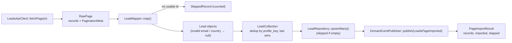

- `execute(SyncId, PageNumber)` fetches, then calls `importFetched()`.
- `importFetched(SyncId, RawPage)` is used when the page was already fetched
  (page 1 by the orchestrator, or pages from a concurrent fetch).
- An API failure (`LeadsApiException`) propagates unchanged so a job can retry it.
- Re-running the same page never creates duplicates (upsert on `profile_key`).

**Field mapping** (`src/Application/Mapper/LeadMapper.php`, `ALIASES`; first name is
the documented one):

| Lead field | API fields tried, in order | Rule |
|---|---|---|
| `profileKey` | `id`, `profile_key`, `PROFILE_KEY` | Required; int or string; ≤ 191 chars; else record skipped |
| `fullName` | `full_name`, `name`, else `first_name` + `last_name` | Trimmed; blank → null |
| `email` | `email`, `email_address` | Lower-cased; invalid → null (lead kept) |
| `positionTitle` | `position_title`, `title`, `job_title` | |
| `companyName` | `company_name`, `company` | |
| `industry` | `industry_name`, `industry` | |
| `location` | `location`, `city` | Not in the documented response → null |
| `countryCode` | `country_code`, `country` | ISO alpha-2, upper-cased; invalid → null |
| `attributes` | whole record | Always kept (includes `email_status`) |

| File | Role |
|---|---|
| `src/Application/Dto/RawPage.php` | Parses a response body: records from `data` (or `leads`, `items`, or a bare list); throws `LeadsApiException::invalidResponse` otherwise |
| `src/Application/Dto/PaginationMeta.php` | Reads `pagination{}` (or `meta{}` or top level): `page`, `limit`, `total`, `total_pages` and aliases |
| `src/Application/Mapper/LeadMapper.php` | Raw records → `MappedLeads` |
| `src/Application/Dto/MappedLeads.php` | `LeadCollection` + skipped records + record count |
| `src/Application/Dto/SkippedRecord.php` | Index + reason of a record that could not become a lead |
| `src/Application/Dto/PageImportResult.php` | Result of one page; `isEmpty()`, `isShorterThan()` |
| `src/Domain/Lead/Lead.php` | The lead entity (identity = `ProfileKey`), `toArray()` |
| `src/Domain/Lead/LeadCollection.php` | Immutable set of unique leads |
| `src/Domain/Lead/ValueObject/*.php` | `ProfileKey`, `Email`, `CountryCode` validation and normalisation |
| `src/Domain/Lead/Exception/InvalidLeadData.php` | Thrown by value objects |
| `src/Domain/Lead/LeadRepository.php` | Persistence port (`upsertMany`, `findByProfileKey`, `count`) |
| `src/Domain/Sync/Event/LeadsPageImported.php` | Event: sync id, page, imported, skipped |

---

## F7 Orchestrated sync (queue path) 🔵 (jobs ⚪)

**Use case:** `src/Application/UseCase/StartLeadSync.php`, meant to run inside the
orchestrator job (step 6).

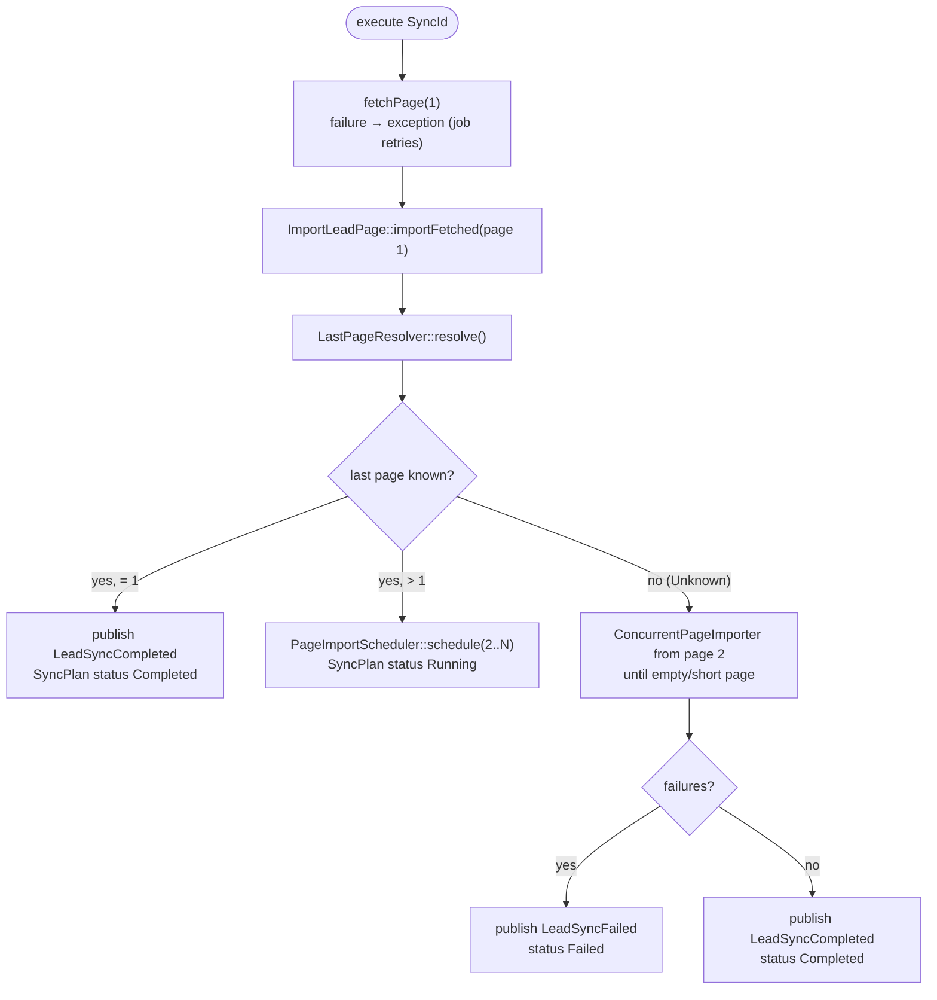

**How the last page is found** (`src/Application/Service/LastPageResolver.php`), in order:

| # | Source | Strategy (`LastPageStrategy`) |
|---|---|---|
| 1 | `pagination.total_pages` (or `last_page`) | `TotalPages` |
| 2 | `ceil(total / limit)` | `TotalRecords` |
| 3 | page 1 has fewer records than a full page → 1 | `ShortFirstPage` |
| 4 | `ceil(countLeads() / pageSize)` | `CountEndpoint` |
| 5 | nothing works | `Unknown` (import until an empty/short page) |

The result is capped at `SyncSettings::$maxPages` (`LEADSCAPTAIN_MAX_PAGES`, 1000).

| File | Role |
|---|---|
| `src/Application/UseCase/StartLeadSync.php` | The orchestrator logic above |
| `src/Application/Service/LastPageResolver.php` | Last-page strategies |
| `src/Application/Dto/LastPageResolution.php` / `LastPageStrategy.php` | Result + enum; `remainingPages()` = 2..N |
| `src/Application/Contract/PageImportScheduler.php` | Port for background scheduling (implementation ⚪ step 6: `Bus::batch`) |
| `src/Application/Dto/SyncPlan.php` | What happened: status, resolution, first page, scheduled count, inline result |
| `src/Domain/Sync/SyncId.php` | Sync identity (UUID v4 or a batch id) |
| `src/Domain/Sync/SyncStatus.php` | `Pending`, `Running`, `Completed`, `Failed` + allowed transitions |
| `src/Domain/Sync/Event/LeadSyncCompleted.php`, `LeadSyncFailed.php` | Sync outcome events |

---

## F8 In-process sync (--now path) 🔵

**Use case:** `src/Application/UseCase/SyncLeadsImmediately.php`, for
`leadscaptain:sync --now` (step 7). Runs everything in one process, no queue.

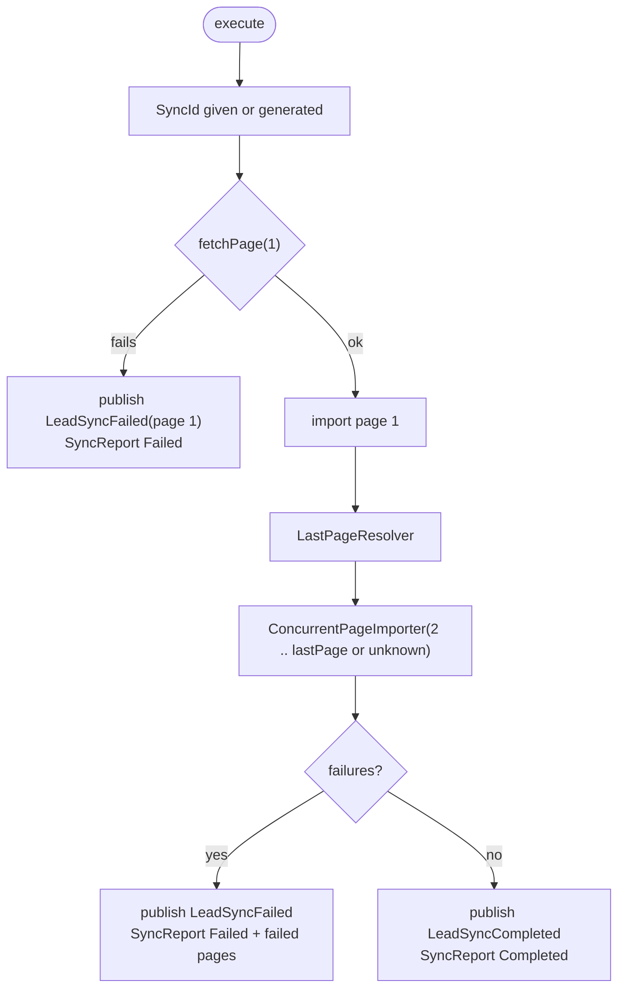

**`ConcurrentPageImporter`** (`src/Application/Service/ConcurrentPageImporter.php`):
fetches up to `concurrency` pages at once via `LeadsApiClient::fetchPages()`, imports
each, and stops when the range ends, an empty or short page arrives (unknown range),
`maxPages` is reached, or any page in a window fails.

| File | Role |
|---|---|
| `src/Application/UseCase/SyncLeadsImmediately.php` | Flow above; never throws, returns a report |
| `src/Application/Service/ConcurrentPageImporter.php` | Windowed concurrent import |
| `src/Application/Dto/RangeImportResult.php` | Imported pages, failures, `reachedEnd` |
| `src/Application/Dto/PageFetchFailure.php` | One failed page from `fetchPages()` |
| `src/Application/Dto/SyncReport.php` | Summary for the command (status, strategy, pages, leads, skipped, failed pages) |
| `src/Application/Config/SyncSettings.php` | `pageSize`, `maxPages`, `concurrency` (validated ≥ 1) |

---

## F9 Calling the Leadscaptain API 🔵

**File:** `src/Infrastructure/Http/LeadscaptainHttpClient.php` (implements
`LeadsApiClient`).

**Request:** `GET {base_url}{leads_path}?{page_param}=n&{page_size_param}=size`,
`Accept: application/json`, timeout / connect timeout, and the key as
`X-API-Key: <key>` (configurable header) or `Authorization: Bearer <key>`
(`LEADSCAPTAIN_AUTH_SCHEME=bearer`). No key → no auth header.

| Method | Attempts | Rate limiter | Used by |
|---|---|---|---|
| `fetchPage(n)` | 1 (caller retries) | not used (caller checks) | `ImportLeadPage`, `StartLeadSync` (page 1) |
| `fetchPages(...)` | 1 + up to `retry.times` | 1 slot per request, waits when denied | `ConcurrentPageImporter` |
| `countLeads()` | 1 | not used | `LastPageResolver` (strategy 4) |

**How a response becomes a result or an error:**

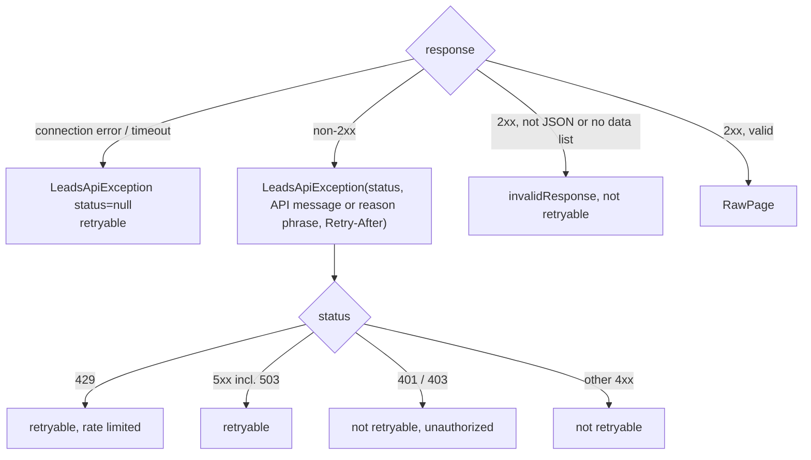

**Retry waits** (`src/Infrastructure/Http/RetryPolicy.php`, used by `fetchPages()`;
the step 6 jobs will reuse it):

| Failure | Waits before retry 1 / 2 / 3 | Config |
|---|---|---|
| `Retry-After` header present | that many seconds (any status) | API |
| 429 | 1 s / 2 s / 4 s | `LEADSCAPTAIN_RATE_LIMIT_BACKOFF_MS` |
| 5xx, 503, timeout | 1 s / 5 s / 30 s | `LEADSCAPTAIN_RETRY_BACKOFF_MS` |
| 401, 403, other 4xx, invalid body | no retry | |

After the last retry the page is logged with `outcome: gave_up` and returned as a
`PageFetchFailure`.

| File | Role |
|---|---|
| `src/Infrastructure/Http/LeadscaptainHttpClient.php` | Requests, pool, retries, error mapping, logging |
| `src/Infrastructure/Http/ApiSettings.php` | Connection settings from config (validates auth scheme, page size) |
| `src/Infrastructure/Http/RetryPolicy.php` | Retry decision + delay |
| `src/Application/Exception/LeadsApiException.php` | Failure with page, status, `Retry-After`; `isRetryable()`, `isRateLimited()`, `isUnauthorized()` |
| `src/Application/Contract/LeadsApiClient.php` | The port the use cases depend on |

---

## F10 Rate limiting 🔵

**Files:** `src/Infrastructure/RateLimit/RequestRateLimiter.php` (interface),
`src/Infrastructure/RateLimit/RedisRateLimiter.php`.

Sliding window shared by every worker: timestamps of recent requests live in one
Redis sorted set. Each call is one Lua script (atomic) using the Redis server clock.

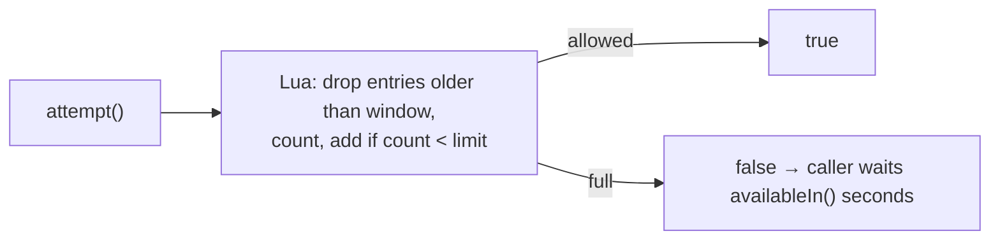

| Setting | Default | Env |
|---|---|---|
| Max requests per window | 60 | `LEADSCAPTAIN_RATE_LIMIT` (0 disables) |
| Window (seconds) | 60 | `LEADSCAPTAIN_RATE_LIMIT_WINDOW` |
| Redis connection | `default` | `LEADSCAPTAIN_REDIS_CONNECTION` |

Current users: `LeadscaptainHttpClient::fetchPages()` sleeps until a slot is free.
Planned (step 6): page jobs call `attempt()` and `release()` themselves instead of
sleeping.

---

## F11 Storing leads 🟢 table / 🔵 writes via sync

**Table** (`packages/leadscaptain/database/migrations/2026_09_24_000000_create_leadscaptain_leads_table.php`,
loaded automatically by the provider):

| Column | Type | Notes |
|---|---|---|
| `id` | bigint PK | insertion order (used by the list endpoint) |
| `profile_key` | varchar(191) UNIQUE | upsert key (API `id`) |
| `full_name`, `email`, `position_title`, `company_name`, `industry`, `location` | varchar(255) null | `email` indexed |
| `country_code` | char(2) null | indexed |
| `raw_attributes` | json null | full source record (`attributes` would clash with Eloquent) |
| `last_synced_at` | timestamp null | set on every upsert |
| `created_at`, `updated_at` | timestamps | `created_at` kept on update |

**Write path** (`src/Infrastructure/Persistence/EloquentLeadRepository.php`):

1. Empty collection → nothing written.
2. One DB transaction; leads in chunks of 500.
3. Each chunk: `INSERT ... ON DUPLICATE KEY UPDATE` (MySQL) / `ON CONFLICT` (SQLite)
   on `profile_key`, updating every column except `created_at`.
4. Text longer than 255 characters is cut to fit; the full value stays in `raw_attributes`.

**Read path:** `findByProfileKey()` and `EloquentLeadQuery::page()` both rebuild
Domain leads with `LeadModel::toLead()`.

| File | Role |
|---|---|
| `database/migrations/2026_09_24_000000_create_leadscaptain_leads_table.php` | Creates the table |
| `src/Infrastructure/Persistence/LeadModel.php` | Eloquent model, casts, `toLead()` |
| `src/Infrastructure/Persistence/EloquentLeadRepository.php` | Idempotent upsert, find, count |
| `src/Infrastructure/Persistence/EloquentLeadQuery.php` | Paged read for the endpoint |

---

## F12 Configuration 🟢

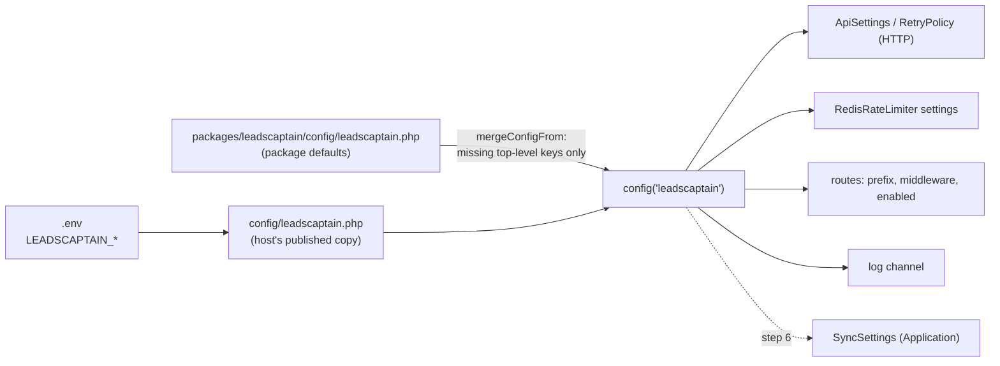

**Important:** the host copy `config/leadscaptain.php` was published before the
`auth` and `routes` blocks existed. Those two blocks still work because they are new
**top-level** keys, which `mergeConfigFrom` fills in. A new key *inside* an existing
block (for example a new `http.*` key) would **not** reach the host until the file is
republished (`php artisan vendor:publish --tag=leadscaptain-config --force`) or edited.

| Env key | Default | Used by |
|---|---|---|
| `LEADSCAPTAIN_BASE_URL` | `https://api.leadscaptain.com` | HTTP client (mock: `http://mock-api:8081`) |
| `LEADSCAPTAIN_API_KEY` | none | HTTP client (mock: `local-dev-key`) |
| `LEADSCAPTAIN_AUTH_SCHEME` / `_API_KEY_HEADER` | `api_key` / `X-API-Key` | HTTP client |
| `LEADSCAPTAIN_LEADS_PATH` / `_COUNT_PATH` | `/api/v1/leads` / `/api/v1/leads/count` | HTTP client |
| `LEADSCAPTAIN_PAGE_PARAM` / `_PAGE_SIZE_PARAM` / `_PAGE_SIZE` | `page` / `limit` / `100` | HTTP client, SyncSettings |
| `LEADSCAPTAIN_MAX_PAGES` | `1000` | SyncSettings (safety cap) |
| `LEADSCAPTAIN_TIMEOUT` / `_CONNECT_TIMEOUT` | `30` / `10` s | HTTP client |
| `LEADSCAPTAIN_CONCURRENCY` | `10` | SyncSettings (pages per window) |
| `LEADSCAPTAIN_RETRY_TIMES` | `3` | RetryPolicy |
| `LEADSCAPTAIN_RETRY_BACKOFF_MS` | `1000,5000,30000` | RetryPolicy (5xx, timeouts) |
| `LEADSCAPTAIN_RATE_LIMIT_BACKOFF_MS` | `1000,2000,4000` | RetryPolicy (429) |
| `LEADSCAPTAIN_RATE_LIMIT` / `_WINDOW` / `_REDIS_CONNECTION` | `60` / `60` / `default` | RedisRateLimiter |
| `LEADSCAPTAIN_QUEUE_CONNECTION` / `_QUEUE` | app default / `leadscaptain` | step 6 jobs |
| `LEADSCAPTAIN_LOG_CHANNEL` / `_STREAM` / `_LEVEL` | `leadscaptain` / `php://stderr` / `info` | log channel |
| `LEADSCAPTAIN_ROUTES_ENABLED` / `_ROUTE_PREFIX` | `true` / `api/leadscaptain` | routes |
| `LEADSCAPTAIN_ALERT_MAIL` | none | reserved (failure alerts go to logs for now) |

Host app settings that matter: `APP_ENV=local`, `APP_DEBUG=true` (local only),
`LOG_CHANNEL=stderr`, `DB_*` pointing at `db`.

---

## F13 Logging 🟢

- The host app logs to stderr (`LOG_CHANNEL=stderr`), so `docker compose logs app`
  shows everything. PHP errors also go to stderr (`docker/php/php.ini`).
- The package adds its own channel `leadscaptain`: JSON lines, Monolog channel name
  `leadscaptain`, stream and level from config.
- The HTTP client writes one line per attempt with message `leadscaptain.api_request`:

```json
{"message":"leadscaptain.api_request","context":{"endpoint":"leads","page":7,"attempt":2,"status":503,"duration_ms":412.3,"outcome":"retryable","error":"..."},"level_name":"WARNING","channel":"leadscaptain"}
```

| `outcome` | Level | Meaning |
|---|---|---|
| `ok` | info | Page or count received (`records` = number of records) |
| `retryable` | warning | Failed; may be retried |
| `failed` | error | Failed; not retryable (401, invalid body, ...) |
| `gave_up` | error | Retryable, but no retries left |

The API key is never logged. The sync id and job attempt will be added to the
context in step 6.

---

## F14 Mock Leadscaptain API 🟢

**Files:** `docker/mock-api/router.php`, `docker/mock-api/README.md`,
`mock-api` service in `docker-compose.yml` (profile `mock`).

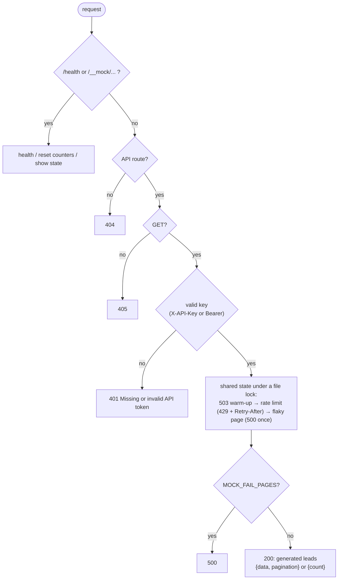

Leads are generated from their id (1 to `MOCK_TOTAL_LEADS`, default 1234), so every
run returns identical data. All `MOCK_*` settings are listed in
`docker/mock-api/README.md`. To point the app at it: `LEADSCAPTAIN_BASE_URL=http://mock-api:8081`
and `LEADSCAPTAIN_API_KEY=local-dev-key`.

---

## F15 Tests and quality checks 🟢

```mermaid
flowchart LR
    subgraph pkg["package-tests container (PHP 8.4, Laravel 13 via Testbench)"]
        u[Unit] --- f[Feature] --- i[Integration]
    end
    subgraph host["app container (Laravel 12)"]
        h["php artisan test"]
    end
    mysql[("MySQL leadscaptain_test")] -. optional .- i
    redisT[("Redis")] -. "skipped if absent" .- i
```

| Suite | Folder | What it covers | Runs on |
|---|---|---|---|
| Unit | `tests/Unit` | Domain, Application (with in-memory fakes), `ApiSettings`, `RetryPolicy`, architecture rules | plain PHPUnit |
| Feature | `tests/Feature` | Service provider, HTTP client with `Http::fake()`, leads endpoint | Testbench |
| Integration | `tests/Integration` | Eloquent repository and query, page re-import, Redis limiter | SQLite in memory (default) or MySQL; real Redis |
| Host app | `tests/` (root) | Demo app boots, home page 200 | host app container |

**Test helpers** (`packages/leadscaptain/tests/Support`):

| File | Stands in for |
|---|---|
| `FakeLeadsApiClient.php` | The API: generated leads in the documented shape; can fail pages, hide pagination, set a count |
| `InMemoryLeadRepository.php` | `LeadRepository` (idempotent by profile key) |
| `InMemoryLeadQuery.php` | `LeadQuery` |
| `RecordingEventPublisher.php` | `DomainEventPublisher`; `ofType()` filters events |
| `RecordingPageImportScheduler.php` | `PageImportScheduler`; records scheduled pages |
| `FakeRateLimiter.php` | `RequestRateLimiter`; denies N attempts |
| `RecordingLogger.php` | PSR-3 logger; `contexts()` per message |
| `Fixture.php` | Loads `tests/Fixtures/*.json` (the documented sample response) |

Quality tools: `phpstan.neon.dist` (Larastan level 8 on `src` and `config`),
`pint.json` (Laravel preset + strict types + final classes).

---

## F16 Docker images 🟢

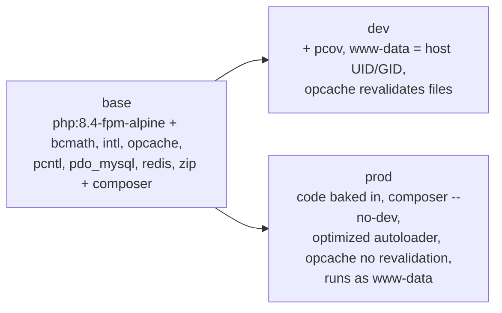

- `Dockerfile` (root): app image. `docker-compose.yml` uses `dev`;
  `docker build --target prod .` builds the production image. The prod image copies
  `packages/` before `composer install` because of the path repository.
- `packages/leadscaptain/Dockerfile`: standalone test image (PHP 8.4 CLI + pcov),
  used by the `package-tests` service with its own `vendor` volume.
- `.dockerignore` / `packages/leadscaptain/.dockerignore`: keep `vendor`, `.env`,
  caches and logs out of build contexts.

---

## F17 Planned flows ⚪

| Flow | Step | Files to come (names from the plan) |
|---|---|---|
| Queued sync: orchestrator job → batch of page jobs on Horizon | 6 | `SyncLeadsOrchestratorJob`, `ImportLeadPageJob`, `BatchPageImportScheduler` |
| Job retries without burning attempts on rate limiting | 6 | failure counter per sync+page, `retryUntil()`, `release()` |
| Events to Laravel listeners and a gRPC stub | 6 | `LaravelDomainEventPublisher`, `GrpcDomainEventPublisher` |
| Failure alert written to the log | 6 | `LeadSyncFailedNotification` + log notification channel, listener on `LeadSyncFailed` |
| Provider bindings for all ports | 6 | `LeadscaptainServiceProvider` |
| `leadscaptain:sync` and `--now` | 7 | sync command |
| `POST /api/leadscaptain/sync`, `GET /api/leadscaptain/sync/{batchId}` | 7 | sync controller |
| CI (Pint, PHPStan, tests ≥ 90 %, MySQL + Redis, prod build, deploy) | 8 | `.github/workflows/ci.yml` |

---

## 4. File reference

Every tracked file, grouped by folder. "Flow" links to the sections above.

### Repository root

| File | Purpose | Used by / when | Flow |
|---|---|---|---|
| `README.md` | Setup, everyday commands, mock API, troubleshooting | People | F1, F2 |
| `Makefile` | Shortcuts: `setup`, `build`, `bootstrap`, `up`, `down`, `migrate`, `test`, `package-test`, `queue-up`, `mock-up`, `shell`, `logs`, `pint` | You (needs `make`; raw commands in README) | F1, F2, F15 |
| `docker-compose.yml` | Services: `app`, `nginx`, `db`; profiles `queue` (redis, horizon), `mock` (mock-api), `test` (package-tests) | `docker compose ...` | F1, F14, F15 |
| `Dockerfile` | App image: `base`, `dev`, `prod` targets | compose (`dev`), production build (`prod`) | F16 |
| `.dockerignore` | Excludes vendor, `.env`, caches, logs, compose files from the build context | `docker build` | F16 |
| `.env.example` | Template for `.env`: `APP_ENV=local`, `APP_DEBUG=true`, Docker hosts, `LEADSCAPTAIN_*`, empty `APP_KEY` | `bootstrap.sh`, new clones | F2, F12 |
| `.env` (not in git) | Real local settings, including `APP_KEY` and the API key | Laravel at runtime | F12 |
| `.gitignore` | Ignores `vendor`, `node_modules`, `.env`, IDE folders, logs | git | |
| `.phpunit.result.cache` | PHPUnit cache committed by the scaffold; rewritten by host test runs (candidate for `.gitignore`) | PHPUnit | F15 |
| `composer.json` / `composer.lock` | Host app dependencies; path repository to `./packages/leadscaptain` | Composer (inside the container only) | F2 |
| `package.json` | Laravel skeleton front-end tooling (Vite); not used by this project | npm (unused) | |
| `phpunit.xml` | Host app test config (SQLite in memory, sync queue, array cache) | `php artisan test` | F15 |
| `artisan` | Laravel CLI entry point | `php artisan ...` | F2 |

### Demo app (Laravel 12 skeleton)

| File | Purpose | Notes |
|---|---|---|
| `app/Http/Controllers/Controller.php` | Base controller | Skeleton; unused |
| `app/Models/User.php` | User model | Skeleton; unused |
| `app/Providers/AppServiceProvider.php` | Host provider | Empty; registered in `bootstrap/providers.php` |
| `bootstrap/app.php` | Builds the app, registers `routes/web.php`, `routes/console.php` | F3 |
| `bootstrap/providers.php` | Lists host providers | F3 (the package registers itself via auto-discovery) |
| `config/*.php` (app, auth, cache, database, filesystems, logging, mail, queue, services, session) | Laravel config, read from `.env` | Cache and sessions use the database driver, so a fresh DB needs `migrate` |
| `config/leadscaptain.php` | **Published copy** of the package config (older; see F12) | F12 |
| `database/migrations/0001_01_01_*` | Laravel tables: users, cache, jobs, `job_batches`, `failed_jobs` | `job_batches` will be used by step 6 |
| `database/factories/UserFactory.php`, `database/seeders/DatabaseSeeder.php` | Skeleton | Unused |
| `public/index.php`, `public/.htaccess` | Front controller (nginx ignores `.htaccess`) | F3 |
| `resources/views/welcome.blade.php`, `resources/css`, `resources/js` | Skeleton home page and assets | `GET /` |
| `routes/web.php` | `GET /` → welcome view | F3 |
| `routes/console.php` | Skeleton `inspire` command | |
| `tests/Feature/ExampleTest.php`, `tests/Unit/ExampleTest.php`, `tests/TestCase.php` | Host smoke tests | F15 |
| `scripts/bootstrap.sh` | First-time setup (see F2) | F2 |

### Docker support files

| File | Purpose | Flow |
|---|---|---|
| `docker/nginx/default.conf` | Serves `public/`, forwards PHP to `app:9000`, blocks dotfiles, 20 MB uploads | F1, F3 |
| `docker/php/php.ini` | 256 MB memory, 60 s max execution, UTC, errors to stderr, opcache on (off for CLI) | F1, F13 |
| `docker/mock-api/router.php` | The mock API (routes, auth, generated leads, failure simulation, shared state file) | F14 |
| `docker/mock-api/README.md` | Mock usage and every `MOCK_*` setting | F14 |

### Documentation

| File | Purpose |
|---|---|
| `docs/architecture.md` | Design: containers, layers, data model, flow diagrams, open decisions |
| `docs/app-flow.md` | This file: flows and file reference |

### Package: `packages/leadscaptain` (tooling)

| File | Purpose |
|---|---|
| `composer.json` | Package name `leadscaptain/laravel-leadscaptain`, PHP ^8.4, Laravel 12/13 components, Guzzle, psr/log; PSR-4 `Leadscaptain\` → `src/`; provider auto-discovery; scripts `test`, `lint`, `format`, `stan` |
| `Dockerfile` | Standalone test image (F16) |
| `.dockerignore`, `.gitignore` | Exclude vendor, lock file, caches (the package lock file is not committed) |
| `phpunit.xml.dist` | Suites Unit, Feature, Integration; SQLite in memory; log stream to memory |
| `phpstan.neon.dist` | Larastan level 8 on `src` and `config` |
| `pint.json` | Code style rules |
| `README.md` | Package layout and how to run its tests |
| `config/leadscaptain.php` | Package defaults for every `LEADSCAPTAIN_*` setting (F12) |
| `database/migrations/2026_09_24_000000_create_leadscaptain_leads_table.php` | Leads table (F11) |
| `routes/api.php` | `GET leads` route (F5) |

### Package: `src/Domain` (pure PHP)

| File | Purpose | Used by |
|---|---|---|
| `Lead/Lead.php` | Lead entity: `profileKey`, name, email, title, company, industry, location, country, raw `attributes`; trims text, `toArray()` | Mapper, repository, query, resource |
| `Lead/LeadCollection.php` | Immutable, unique by profile key (last wins); `merge()`, `profileKeys()` | Mapper, repository |
| `Lead/LeadRepository.php` | Persistence port | `ImportLeadPage`; implemented by `EloquentLeadRepository` |
| `Lead/ValueObject/ProfileKey.php` | Non-empty, ≤ 191 chars, trimmed | Lead identity |
| `Lead/ValueObject/Email.php` | Valid email, lower-cased; `fromNullable()` | Mapper, model |
| `Lead/ValueObject/CountryCode.php` | Two letters, upper-cased; `fromNullable()` | Mapper, model |
| `Lead/Exception/InvalidLeadData.php` | Validation errors from the value objects | Mapper catches it |
| `Shared/DomainEvent.php` | Event contract: `eventName()`, `occurredAt()`, primitive `payload()` | All events, publishers |
| `Sync/SyncId.php` | Sync identity; `generate()` = UUID v4 | Use cases, events |
| `Sync/PageNumber.php` | Page ≥ 1; `first()`, `next()` | Everywhere pages appear |
| `Sync/SyncStatus.php` | Status enum + `canTransitionTo()` | `SyncPlan`, `SyncReport` |
| `Sync/Event/LeadsPageImported.php` | Page imported (counts) | `ImportLeadPage` |
| `Sync/Event/LeadSyncCompleted.php` | Sync finished (pages, leads) | `StartLeadSync`, `SyncLeadsImmediately` |
| `Sync/Event/LeadSyncFailed.php` | Sync failed (reason, page) | same |

### Package: `src/Application` (framework-free)

| File | Kind | Purpose | Flow |
|---|---|---|---|
| `Config/SyncSettings.php` | settings | Page size, max pages, concurrency | F7, F8 |
| `Contract/LeadsApiClient.php` | port | Fetch one page, many pages, count | F6–F9 |
| `Contract/PageImportScheduler.php` | port | Schedule pages in the background | F7 |
| `Contract/DomainEventPublisher.php` | port | Publish domain events | F6–F8 |
| `Contract/LeadQuery.php` | port | Paged read of stored leads | F5 |
| `Dto/RawPage.php` | DTO | Parsed response page | F6 |
| `Dto/PaginationMeta.php` | DTO | Pagination numbers with aliases | F6, F7 |
| `Dto/PageFetchFailure.php` | DTO | One failed page of `fetchPages()` | F8, F9 |
| `Dto/MappedLeads.php` | DTO | Mapper output | F6 |
| `Dto/SkippedRecord.php` | DTO | Unusable record + reason | F6 |
| `Dto/PageImportResult.php` | DTO | One page's counts | F6 |
| `Dto/RangeImportResult.php` | DTO | Many pages' counts + failures | F8 |
| `Dto/LastPageResolution.php` | DTO | Last page + strategy + capped flag | F7 |
| `Dto/LastPageStrategy.php` | enum | How the last page was found | F7 |
| `Dto/SyncPlan.php` | DTO | Orchestrator result | F7 |
| `Dto/SyncReport.php` | DTO | `--now` result | F8 |
| `Dto/LeadListPage.php` | DTO | One page of stored leads | F5 |
| `Exception/LeadsApiException.php` | exception | API failure classification | F9 |
| `Mapper/LeadMapper.php` | mapper | Raw record → Lead (aliases) | F6 |
| `Service/LastPageResolver.php` | service | Last-page strategies | F7 |
| `Service/ConcurrentPageImporter.php` | service | Windowed concurrent import | F8 |
| `UseCase/ImportLeadPage.php` | use case | Import one page | F6 |
| `UseCase/StartLeadSync.php` | use case | Orchestrator | F7 |
| `UseCase/SyncLeadsImmediately.php` | use case | In-process full sync | F8 |
| `UseCase/ListStoredLeads.php` | use case | Paged listing | F5 |

### Package: `src/Infrastructure` (Laravel adapters)

| File | Implements | Purpose | Flow |
|---|---|---|---|
| `Http/LeadscaptainHttpClient.php` | `LeadsApiClient` | API calls, pool, retries, logging | F9 |
| `Http/ApiSettings.php` | | Connection settings from config | F9, F12 |
| `Http/RetryPolicy.php` | | Retry decision and delays | F9 |
| `RateLimit/RequestRateLimiter.php` | (interface) | `attempt()`, `availableIn()` | F10 |
| `RateLimit/RedisRateLimiter.php` | `RequestRateLimiter` | Redis sliding window | F10 |
| `Persistence/LeadModel.php` | | Eloquent model, `toLead()` | F5, F11 |
| `Persistence/EloquentLeadRepository.php` | `LeadRepository` | Idempotent upsert | F11 |
| `Persistence/EloquentLeadQuery.php` | `LeadQuery` | Paged read | F5 |

### Package: `src/Presentation` and provider

| File | Purpose | Flow |
|---|---|---|
| `Presentation/Http/Controllers/LeadController.php` | `GET {prefix}/leads`: validation, use case, JSON with meta and links | F5 |
| `Presentation/Http/Resources/LeadResource.php` | Lead → JSON | F5 |
| `LeadscaptainServiceProvider.php` | Config merge, log channel, migrations, routes, bindings, publishing | F4 |

### Package: `tests`

| File | Covers |
|---|---|
| `TestCase.php` | Testbench base; loads the service provider |
| `Fixtures/api/leads-page.json` | The documented sample response |
| `Support/*` | Test doubles (see F15) |
| `Unit/Architecture/LayerBoundariesTest.php` | Layer rules, no Laravel helpers in Domain/Application, strict types everywhere |
| `Unit/Domain/**` | Lead, collection, value objects, sync types, events |
| `Unit/Application/Config/SyncSettingsTest.php` | Settings validation |
| `Unit/Application/Dto/PaginationMetaTest.php`, `RawPageTest.php` | Response parsing and aliases |
| `Unit/Application/Exception/LeadsApiExceptionTest.php` | Retryable / rate-limited / unauthorized rules |
| `Unit/Application/Mapper/LeadMapperTest.php` | Field mapping, skips, invalid values |
| `Unit/Application/Service/LastPageResolverTest.php` | Every strategy and the cap |
| `Unit/Application/Service/ConcurrentPageImporterTest.php` | Windows, stop conditions, failures |
| `Unit/Application/UseCase/*Test.php` | `ImportLeadPage`, `StartLeadSync`, `SyncLeadsImmediately`, `ListStoredLeads` |
| `Unit/Infrastructure/Http/ApiSettingsTest.php`, `RetryPolicyTest.php` | Config parsing, retry delays |
| `Feature/ServiceProviderTest.php` | Config merge, log channel name, migrations loaded and publishable, config publishable |
| `Feature/Http/LeadscaptainHttpClientTest.php` | Headers, query, errors, Retry-After, pool, retries, rate limiting, count, logging |
| `Feature/Http/ListLeadsEndpointTest.php` | Endpoint JSON, pagination, validation, prefix, disabling, route name |
| `Integration/Persistence/EloquentLeadRepositoryTest.php` | Insert, update, idempotency, chunks, truncation, unicode |
| `Integration/Persistence/EloquentLeadQueryTest.php` | Paged read and mapping |
| `Integration/Persistence/ImportLeadPagePersistenceTest.php` | Re-importing pages creates no duplicates |
| `Integration/RateLimit/RedisRateLimiterTest.php` | Real Redis window (skipped without Redis) |

---

## 5. Where do I look when...

| Question | Look at |
|---|---|
| The API changes a field name | `LeadMapper::ALIASES`, `tests/Fixtures/api/leads-page.json`, `LeadMapperTest` |
| The API pagination block changes | `PaginationMeta` (`BLOCKS`, key lists), `LastPageResolver` |
| The API needs a different auth header | `.env`: `LEADSCAPTAIN_AUTH_SCHEME`, `LEADSCAPTAIN_API_KEY_HEADER` |
| A status code should (not) be retried | `LeadsApiException::isRetryable()`, `RetryPolicy` |
| Retry waits are wrong | `.env`: `LEADSCAPTAIN_RETRY_BACKOFF_MS`, `LEADSCAPTAIN_RATE_LIMIT_BACKOFF_MS` |
| Too many requests hit the API | `.env`: `LEADSCAPTAIN_RATE_LIMIT`, `_WINDOW`; `RedisRateLimiter` |
| Leads are duplicated | `profile_key` unique index (migration), `EloquentLeadRepository::upsertMany`, `LeadCollection` |
| A column value looks cut off | `EloquentLeadRepository::fit()` (255 chars); full value in `raw_attributes` |
| The endpoint URL or its auth | `.env`: `LEADSCAPTAIN_ROUTE_PREFIX`, `_ROUTES_ENABLED`; `config/leadscaptain.php` → `routes.middleware` |
| The JSON fields of a lead | `LeadResource` |
| Why a config change is ignored | F12 (host copy wins; run `php artisan config:clear`) |
| What the logs mean | F13 |
| Simulating API failures | `docker/mock-api/README.md` |
| Which layer a new class belongs in | Section 1 rules + `LayerBoundariesTest` |

---

## 6. Command cheat sheet

Run from the repository root in PowerShell. PHP, Composer and Artisan run inside
containers.

```powershell
# Stack
docker compose up -d --wait                                   # app, nginx, db
docker compose --profile queue up -d redis                    # Redis only (Horizon is not installed yet)
docker compose --profile mock up -d --wait mock-api           # mock API on :8081
docker compose ps
docker compose logs -f app

# App
docker compose exec -u www-data app php artisan migrate
docker compose exec -u www-data app php artisan config:clear
docker compose exec -u www-data app php artisan route:list --path=leadscaptain
curl.exe -s "http://localhost:8080/api/leadscaptain/leads?per_page=5"

# Tests and checks
docker compose --profile test run --rm package-tests
docker compose --profile test run --rm package-tests sh -c "vendor/bin/phpunit --coverage-text --only-summary-for-coverage-text"
docker compose --profile test run --rm package-tests sh -c "vendor/bin/phpstan analyse --memory-limit=1G src"
docker compose --profile test run --rm package-tests sh -c "vendor/bin/pint --test"
docker compose exec -u www-data app php artisan test

# Data
docker compose exec db mysql -ularavel -psecret laravel -e "SELECT COUNT(*) FROM leadscaptain_leads;"

# Mock API from Windows
curl.exe -s -H "X-API-Key: local-dev-key" "http://localhost:8081/api/v1/leads?page=1&limit=2"
```
