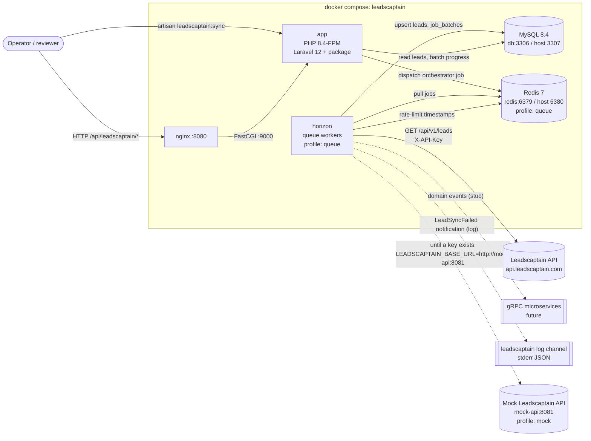
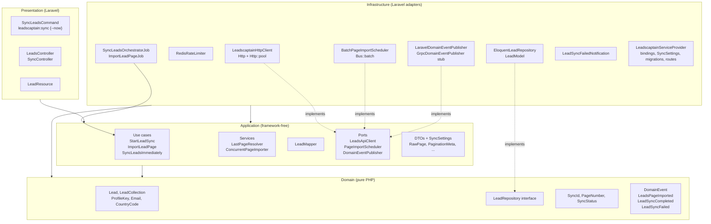
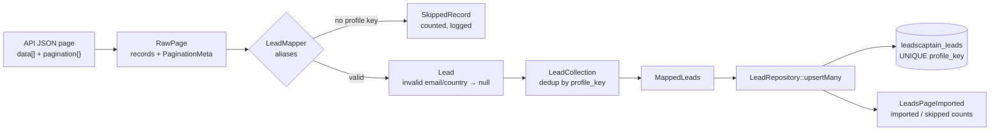
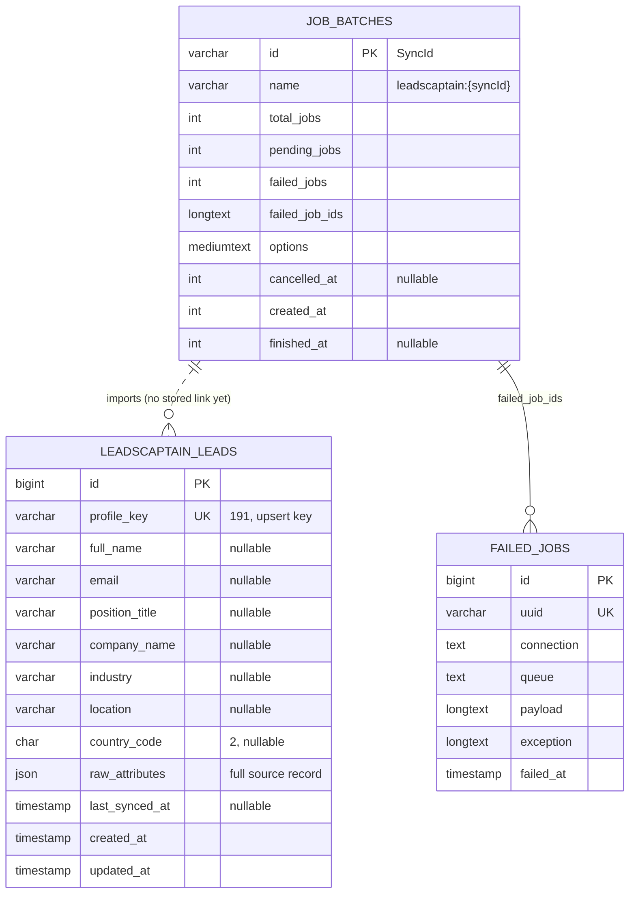
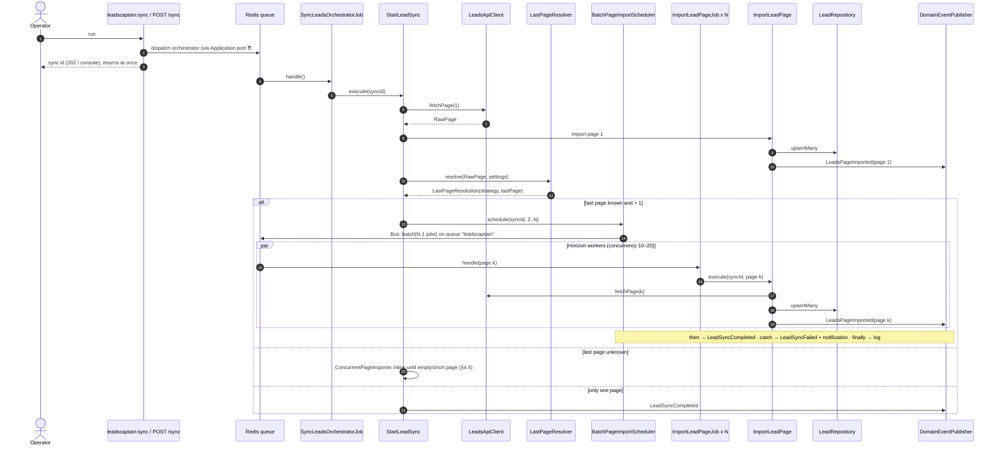
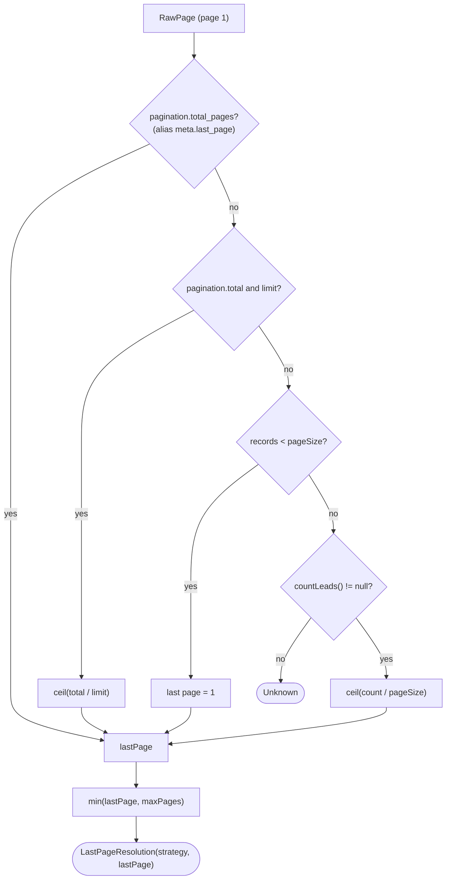
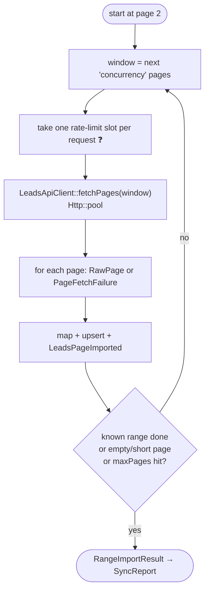
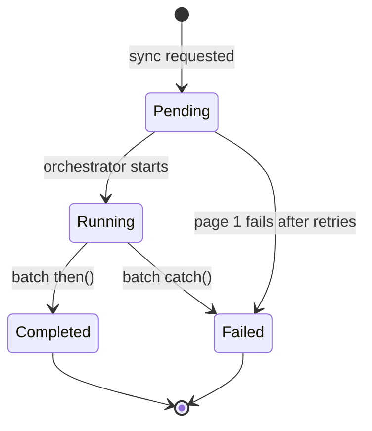
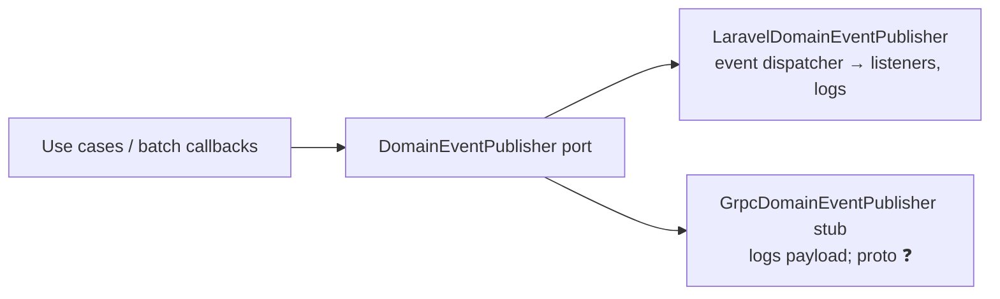
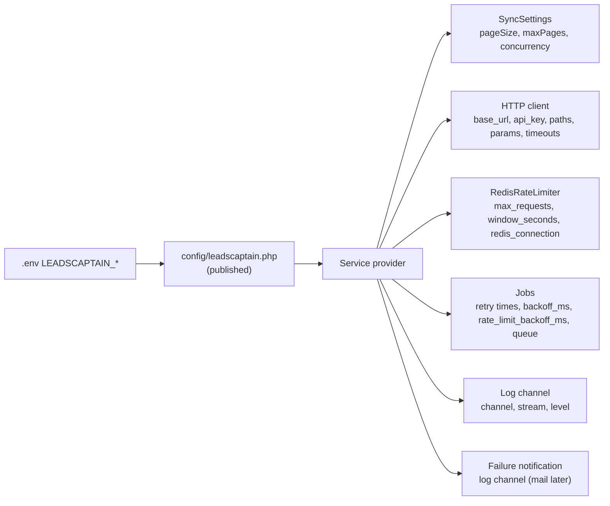

# Leadscaptain: architecture and flows

Reference for the `packages/leadscaptain` package and the demo app that hosts it.
Diagrams are Mermaid (rendered by GitHub and the VS Code Markdown preview).

**Status legend** used in the tables:

- ✅ exists in the repo
- 🟡 described in the plan, not in the repo yet
- ❓ open decision (see [Open decisions](#10-open-decisions))

---

## 1. System context (runtime)



| Container | Image / target | Role |
|---|---|---|
| `app` | `Dockerfile` target `dev` (bind mount) / `prod` (baked) | PHP-FPM, artisan, HTTP endpoints |
| `nginx` | `nginx:1.27-alpine` | Serves `public/`, forwards `.php` to `app:9000` |
| `db` | `mysql:8.4` | Leads, `job_batches`, `jobs`, `failed_jobs`, sessions, cache |
| `redis` | `redis:7-alpine` | Queue, Horizon state, rate-limiter window |
| `horizon` | same image as `app` | Runs `SyncLeadsOrchestratorJob` and `ImportLeadPageJob` |
| `package-tests` | `packages/leadscaptain/Dockerfile` | Standalone Testbench suite (no host app) |
| `mock-api` | `php:8.4-cli-alpine` + `docker/mock-api/router.php` | Offline stand-in for the API (documented shape, simulated 401/429/500/503); profile `mock` |

---

## 2. Application architecture (Onion / DDD)

Dependencies point inwards only. `LayerBoundariesTest` enforces: Domain and Application are
framework-free (no Illuminate, Laravel, Guzzle or helpers such as `config()`), Application
never imports Infrastructure/Presentation, and Presentation never imports Infrastructure.



### Components by layer

| Layer | Component | Responsibility | Status |
|---|---|---|---|
| Domain | `Lead`, `LeadCollection`, value objects | Lead identity (`ProfileKey`), normalisation, dedup (last one wins) | ✅ |
| Domain | `LeadRepository` | `upsertMany()` (idempotent), `findByProfileKey()`, `count()` | ✅ |
| Domain | `SyncId`, `PageNumber`, `SyncStatus` | Sync identity, page arithmetic, allowed status transitions | ✅ |
| Domain | `LeadsPageImported`, `LeadSyncCompleted`, `LeadSyncFailed` | Events with primitive payloads (gRPC-ready) | ✅ |
| Application | `LeadsApiClient` port | `fetchPage`, `fetchPages(...)` → `RawPage\|PageFetchFailure` per page, `countLeads` | ✅ |
| Application | `PageImportScheduler` port | `schedule(SyncId, PageNumber ...)` | ✅ |
| Application | `DomainEventPublisher` port | Publish domain events to any transport | ✅ |
| Application | `SyncSettings` | `pageSize`, `maxPages`, `concurrency` (no `config()` in Application) | ✅ |
| Application | `LeadMapper` | Raw record → `Lead`; aliases; skip records without a key; drop invalid email/country | ✅ |
| Application | `LastPageResolver` | Work out the last page (see §4.3) | ✅ |
| Application | `ConcurrentPageImporter` | Import pages in windows of `concurrency` via `fetchPages` | ✅ |
| Application | `StartLeadSync` | Orchestrator: page 1 → resolve → schedule 2..N (or import inline) | ✅ |
| Application | `ImportLeadPage` | Fetch → map → upsert → publish `LeadsPageImported` | ✅ |
| Application | `SyncLeadsImmediately` | `--now` path, no queue | ✅ |
| Infrastructure | `LeadscaptainHttpClient`, `ApiSettings`, `RetryPolicy` | Base URL, `X-API-Key` or Bearer, timeouts, `page`/`limit`, per-attempt logging; `fetchPages` pools, rate-limits and retries | ✅ step 4 |
| Infrastructure | `RedisRateLimiter` (`RequestRateLimiter`) | Sliding window in a Redis sorted set (atomic Lua, Redis clock): `attempt()`, `availableIn()` | ✅ step 4 |
| Infrastructure | `LeadModel`, `EloquentLeadRepository`, migration | `upsert()` on `profile_key` in chunks of 500, one transaction; loaded via `loadMigrationsFrom` | ✅ step 5 |
| Infrastructure | Jobs, `BatchPageImportScheduler`, publishers, notification | Queue, batch lifecycle, events, alerts | 🟡 step 6 |
| Infrastructure | `LeadscaptainServiceProvider` | Config, log channel ✅; bindings, migrations, commands, routes 🟡 | ✅/🟡 |
| Presentation | `leadscaptain:sync {--now}`, 3 routes, `LeadResource` | Entry points; call Application only | 🟡 step 7 |

### Port → adapter bindings (service provider)

| Contract | Bound to |
|---|---|
| `Application\Contract\LeadsApiClient` | `Infrastructure\Http\LeadscaptainHttpClient` |
| `Application\Contract\PageImportScheduler` | `Infrastructure\Queue\BatchPageImportScheduler` |
| `Application\Contract\DomainEventPublisher` | `Infrastructure\Events\LaravelDomainEventPublisher` (gRPC stub alongside it) |
| `Domain\Lead\LeadRepository` | `Infrastructure\Persistence\EloquentLeadRepository` |
| Rate limiter interface | `Infrastructure\RateLimit\RedisRateLimiter` |
| `Application\Config\SyncSettings` | Built from `config('leadscaptain.*')` |

---

## 3. Data architecture

### 3.1 Data pipeline: API → domain → database



Field mapping, based on the **documented sample response** (not yet checked
against the live API). `LeadMapper::ALIASES` keeps the other names as a fallback
until a live response confirms the shape.

Sample page (`GET /api/v1/leads?page=1&limit=20`):

```json
{
  "data": [
    {
      "id": 123,
      "first_name": "John",
      "last_name": "Doe",
      "email": "john.doe@example.com",
      "position_title": "Senior Developer",
      "company_name": "ABC Technologies",
      "country_code": "IN",
      "industry_name": "Technology",
      "email_status": "verified"
    }
  ],
  "pagination": { "page": 1, "limit": 20, "total": 1, "total_pages": 1 }
}
```

| API field (sample) | Other accepted names | Domain | Column |
|---|---|---|---|
| `id` (int) ✅ decided | `profile_key`, `PROFILE_KEY` | `ProfileKey` (cast to string, trimmed, ≤ 191) | `profile_key` VARCHAR(191) UNIQUE |
| `first_name` + `last_name` | `full_name`, `name` | `fullName` = trimmed "first last", blank → null | `full_name` |
| `email` | | `Email` (lower-case; invalid → null) | `email` |
| `position_title` | `title` | `positionTitle` | `position_title` |
| `company_name` | `company` | `companyName` | `company_name` |
| `industry_name` | `industry` | `industry` | `industry` |
| (not in sample) | `location`, `city` | `location` → null | `location` |
| `country_code` | `country` | `CountryCode` (ISO alpha-2, upper; invalid → null) | `country_code` CHAR(2) |
| `email_status` ✅ decided | | kept in `attributes` only | inside `attributes` |
| whole record | | `attributes` (includes `first_name`, `last_name`, `email_status`) | `raw_attributes` JSON (renamed: `attributes` clashes with Eloquent) |
| (sync context) | | not passed to the repository ❓ | `last_synced_at` (set on every upsert); `last_sync_id` not added yet |

Pagination block → `PaginationMeta`:

| Sample field | Other accepted names | `PaginationMeta` |
|---|---|---|
| `pagination.total_pages` | `meta.last_page`, `last_page` | `lastPage` |
| `pagination.total` | `meta.total`, `total` | `total` |
| `pagination.limit` | `meta.per_page`, `per_page` | `perPage` |
| `pagination.page` | `meta.current_page`, `current_page` | `currentPage` |

Response codes:

| Status | Body | Handling |
|---|---|---|
| `200` | `data[]` + `pagination{}` | Map and upsert |
| `401` | `{"message":"Missing or invalid API token"}` | **Not retried**: fail the sync at once, log it, send the notification |
| `429` | (not in the doc; required by the spec) | Retry: `Retry-After`, else 1s / 2s / 4s |
| `503` | `{"message":"Database is initializing"}` | Retry: 1s / 5s / 30s |
| other `5xx`, timeout | | Retry: 1s / 5s / 30s |
| other `4xx` | | Not retried: page fails |

Authentication: `apiKeyAuth` or `bearerAuth`. The API-key header name is not in
the doc (the live spec says `X-API-Key`), so both the scheme and the header name are
configurable: `LEADSCAPTAIN_AUTH_SCHEME` (`api_key` by default, or `bearer`) and
`LEADSCAPTAIN_API_KEY_HEADER` (default `X-API-Key`).

Filters (`q`, `position_title`, `company_name`, `country_code`, `industry_name`,
`email_status`) exist, but the assignment is "fetch **all** leads", so the sync
sends only `page` and `limit`. Supporting filters is optional, later work.

### 3.2 Storage model



| Store | Key / table | Contents | Owner |
|---|---|---|---|
| MySQL | `leadscaptain_leads` | Leads (idempotent upsert) | Package migration (`loadMigrationsFrom`) |
| MySQL | `job_batches`, `jobs`, `failed_jobs` | Batch progress and failures | Laravel host migrations ✅ |
| MySQL | `sessions`, `cache`, `cache_locks` | Laravel defaults (need `migrate`) | Host ✅ |
| Redis | Rate-limit sorted set (key name ❓, e.g. `leadscaptain:rate_limit`) | Request timestamps within `window_seconds` | `RedisRateLimiter` |
| Redis | `queues:leadscaptain` + Horizon keys | Pending jobs, metrics | Laravel / Horizon |
| stderr | `leadscaptain` log channel (JSON lines) | One line per attempt: page, status, duration_ms, attempt, sync_id | Service provider ✅ |

**Idempotency:** `LeadCollection` removes duplicates within a page, and `upsert()` on
`profile_key` removes them across pages and re-runs. A retried job rewrites the same
rows, and `created_at` is excluded from the update columns.

---

## 4. Flows

### 4.1 Queued sync, end to end (default path)



### 4.2 `ImportLeadPageJob`: rate limit and retry decisions

```mermaid
flowchart TD
    start([Job picked up]) --> cancelled{"batch cancelled?"}
    cancelled -- yes --> stop([return, do nothing])
    cancelled -- no --> slot{"RateLimiter attempt()"}
    slot -- "no slot" --> rel1["release(availableIn())<br/>never sleep()"]
    slot -- ok --> call["ImportLeadPage → fetchPage(k)"]
    call --> ok{"2xx?"}
    ok -- yes --> done([upsert + LeadsPageImported])
    ok -- no --> kind{"LeadsApiException"}
    kind -- "429" --> ra["delay = Retry-After<br/>else 1s / 2s / 4s"]
    kind -- "5xx / 503 / timeout" --> bo["delay = 1s / 5s / 30s"]
    kind -- "other 4xx" --> fail
    ra --> left{"retries left?<br/>max 3 ❓"}
    bo --> left
    left -- yes --> rel2["release(delay)"]
    left -- no --> fail["job fails"]
    fail --> batchfail["batch catch():<br/>batch failed + LeadSyncFailed<br/>+ LeadSyncFailedNotification"]
```

> ❓ Every `release()` increments `attempts()`. With a plain `$tries = 3`, time spent
> waiting for the rate limiter would use up retries. Planned approach: `retryUntil()`
> plus a separate count of real API failures (max 3).

### 4.3 `LastPageResolver`



### 4.4 Direct path: `--now` or unknown last page (`ConcurrentPageImporter`)



### 4.5 Sync status lifecycle (`SyncStatus`)



### 4.6 Domain events → transports



| Event | `eventName()` | Payload |
|---|---|---|
| `LeadsPageImported` | `leadscaptain.leads_page_imported` | `sync_id, page, imported_count, skipped_count, occurred_at` |
| `LeadSyncCompleted` | `leadscaptain.lead_sync_completed` | `sync_id, total_pages, total_leads, occurred_at` |
| `LeadSyncFailed` | `leadscaptain.lead_sync_failed` | `sync_id, reason, failed_page, occurred_at` |

---

## 5. Entry points (Presentation)

| Entry | Behaviour | Calls |
|---|---|---|
| `php artisan leadscaptain:sync` | Queue orchestrator, print sync id | Application (port for dispatch ❓) |
| `php artisan leadscaptain:sync --now` | Run in process, print summary table | `SyncLeadsImmediately` |
| `GET /api/leadscaptain/leads` | Paginated `LeadResource` | Read use case / query ❓ |
| `POST /api/leadscaptain/sync` | `202` + sync id | Same as the command |
| `GET /api/leadscaptain/sync/{batchId}` | Batch progress | Batch status query ❓ |

Route prefix is configurable and uses the `api` middleware.

---

## 6. Configuration → runtime



---

## 7. Logging (one JSON line per attempt)

```json
{"message":"leadscaptain.page_attempt","context":{"sync_id":"9c1e…","page":7,"attempt":2,"status":503,"duration_ms":412},"level_name":"WARNING","channel":"leadscaptain"}
```

---

## 8. Build order

| Step | Scope | Main artefacts |
|---|---|---|
| 1–3 | Domain, Application, test fakes | ✅ Domain, Application, `tests/Support` fakes |
| 4 | Infrastructure / HTTP + rate limit | `LeadscaptainHttpClient`, `RedisRateLimiter` |
| 5 | Infrastructure / persistence | migration, `LeadModel`, `EloquentLeadRepository` |
| 6 | Infrastructure / queue, events, notifications, wiring | jobs, scheduler, publishers, notification, provider bindings |
| 7 | Presentation | command, controllers, resource, routes |
| 8 | CI | `.github/workflows/ci.yml` (Pint, PHPStan, PHPUnit ≥ 90%, MySQL + Redis, prod build, deploy) |
| 9 | Docs and evidence | README, real API run output |

---

## 9. Architecture rules (summary)

- **Domain:** pure PHP. Nothing from `Illuminate\`, `Laravel\`, `GuzzleHttp\` or outer layers.
- **Application:** Domain only. No facades or `config()`; settings arrive via `SyncSettings`.
- **Infrastructure:** implements Application ports and Domain interfaces with Laravel.
- **Presentation:** calls Application use cases only.
- Every `src/` file declares `strict_types`.

---

## 10. Open decisions

| # | Topic | Options / note |
|---|---|---|
| 1 | Real `/api/v1/leads` response shape | Documented sample: `data[]` + `pagination{page, limit, total, total_pages}`. Confirm against the live API, then narrow `LeadMapper::ALIASES` and the fixtures; Domain unchanged |
| 2 | Unique key | ✅ Decided: `id` from the response is the profile key (`profile_key`/`PROFILE_KEY` only as fallbacks) |
| 2a | `email_status` | ✅ Decided: kept in `attributes` only; Domain unchanged |
| 2c | Developing without an API key | ✅ Decided: a mock Leadscaptain API container serves the documented shape; going live = change `LEADSCAPTAIN_BASE_URL` and `LEADSCAPTAIN_API_KEY` |
| 2d | Failure notification channel | ✅ Decided: `LeadSyncFailedNotification` writes to the `leadscaptain` log channel for now; mail (`LEADSCAPTAIN_ALERT_MAIL`) can be added later |
| 2b | Auth scheme / header | ✅ Decided: `LEADSCAPTAIN_AUTH_SCHEME` = `api_key` (default) or `bearer`, `LEADSCAPTAIN_API_KEY_HEADER` (default `X-API-Key`) |
| 3 | `release()` counts as an attempt | `retryUntil()` + own count of API failures (max 3) |
| 4 | `last_sync_id` source | Open: the column is left out. `upsertMany()` has no `SyncId`; adding one is a Domain interface change (needs approval) plus one migration. `last_synced_at` is stored meanwhile |
| 5 | `Http::pool` and the rate limiter | ✅ Decided: `fetchPages()` takes one slot per request and retries itself; `fetchPage()` leaves both to the page job |
| 6 | Presentation → queue dispatch | The command must not import Infrastructure: needs an Application port/use case to start a sync, plus read ports for leads and batch status |
| 7 | Orchestrator runtime when the last page is unknown | Raise job and Horizon `timeout` for the `leadscaptain` queue |
| 8 | Deploy target | Placeholder CI job until a target is given |
| 9 | gRPC contract | Stub publisher until a `.proto` is provided |
